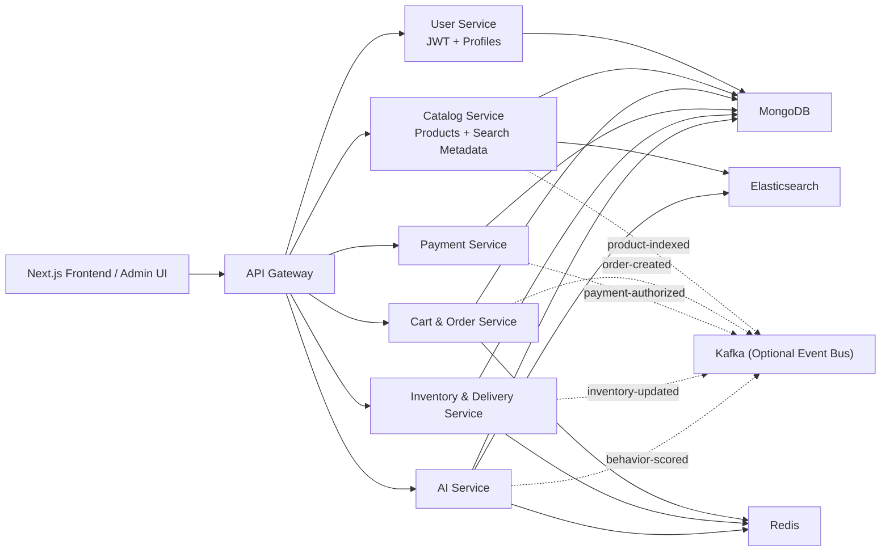
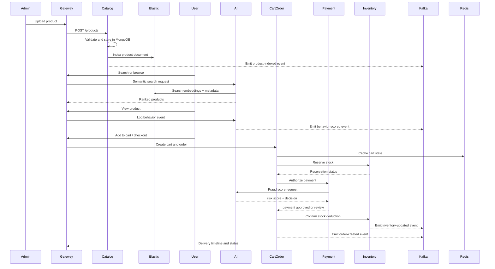

# Amazon-Inspired AI E-Commerce Architecture

This document applies the requested scalable, AI-powered architecture directly to the existing "E-commerce Website" project.

## 1. High-Level Architecture



## 2. Low-Level Execution Flow



## 3. Architecture Applied To The Current Repository

Current state:

- `frontend/` already provides the storefront, admin UI, cart, checkout, order tracking, and AI-themed UX.
- `backend/` already contains product, auth, order, behavior, notification, and AI logic in one Express server.

Target state:

- keep the current frontend
- progressively split the Node backend responsibilities into FastAPI services
- reuse the existing MongoDB domain concepts
- introduce Elasticsearch for semantic and filtered search
- introduce Redis for carts, rate-limits, caching, and inventory locks
- keep Kafka optional for async workflows and demo flexibility

## 4. Service Boundaries

### API Gateway

Responsibilities:

- single public entry point
- request routing
- auth token forwarding
- basic rate-limit and circuit-breaker attachment points
- service health aggregation

Why it matters:

- matches Amazon-style edge entry behavior
- allows the frontend to remain stable while backend internals evolve

### Product Catalog Service

Responsibilities:

- upload and update products
- maintain catalog metadata in MongoDB
- push searchable documents to Elasticsearch
- expose admin-friendly product APIs

Primary stores:

- MongoDB collection for source-of-truth product data
- Elasticsearch index for search queries

### User Authentication And Profile Service

Responsibilities:

- register users
- issue JWT tokens
- manage profiles, preferences, wishlist references, and personalization seeds

Primary stores:

- MongoDB users collection
- Redis for session cache, OTP/rate-limits, and token blacklisting if needed

### Cart And Order Service

Responsibilities:

- maintain cart state
- create orders
- calculate totals
- orchestrate checkout across payment and inventory services

Primary stores:

- Redis for cart state
- MongoDB for durable orders

### Payment Service

Responsibilities:

- payment authorization
- gateway adapter abstraction
- fraud screening
- payment event persistence

Primary stores:

- MongoDB for payment attempts and audit trail
- Kafka optional for downstream accounting or notification workflows

### Inventory And Delivery Service

Responsibilities:

- stock reservation
- stock decrement on successful payment
- low-stock alerts
- demand forecasting
- tracking timeline updates

Primary stores:

- MongoDB for inventory snapshots
- Redis for temporary reservation locks

### AI Service

Responsibilities:

- recommendation engine
- semantic product search using Sentence Transformers MiniLM
- user behavior analysis and personalization
- fraud risk scoring
- demand forecasting

Primary stores:

- MongoDB for behavior history
- Elasticsearch for retrieval
- Redis for cached recommendations and hot search results

## 5. Algorithms Used By Module

| Module | Algorithm / Technique | Why It Fits |
| --- | --- | --- |
| Recommendation | Collaborative filtering | Learns similar-user preference patterns |
| Recommendation | Content-based filtering | Works even for cold-start products using tags, category, brand, and text features |
| Recommendation | Hybrid rank fusion | Balances collaborative, content, and popularity signals |
| Search | Sentence Transformers `all-MiniLM-L6-v2` | Lightweight semantic retrieval for final-year project scale |
| Search | Lexical fallback scoring | Keeps search available when embedding service is unavailable |
| Personalization | Event-weighted scoring | Converts views, cart actions, wishlist, and purchases into preference weights |
| Fraud detection | Rule-based risk scoring with velocity and value thresholds | Easy to explain and strong enough for engineering project demos |
| Demand forecasting | Exponential smoothing + moving-average safety buffer | Simple, production-friendly baseline for inventory planning |
| Inventory | Reservation lock pattern | Prevents overselling during checkout |
| Delivery | Event timeline model | Supports live tracking updates and order history |

## 6. AI/ML Module Design

### Recommendation System

Hybrid pipeline:

1. collect user behavior events
2. compute collaborative scores from user-product interactions
3. compute content similarity from product metadata
4. add popularity and availability boosts
5. return top-N recommendations

This avoids cold-start issues better than collaborative filtering alone.

### Semantic Search

Pipeline:

1. encode user query using MiniLM
2. compare against product embeddings stored or cached for the catalog
3. merge semantic score with filters like category, stock, and rating
4. rerank using business signals such as popularity and availability

### Behavior Analysis And Personalization

Signals:

- search query
- product view
- add-to-cart
- wishlist
- checkout
- purchase

Weights:

- purchase > cart > wishlist > view > search

These weights feed the homepage bands, recommendation lists, and remarketing cues.

### Basic Fraud Detection

Features:

- unusually high order value
- too many items
- repeated checkout attempts in a short time
- COD with high total price
- sudden device or geography change
- brand new user with expensive order

Decisioning:

- `allow`
- `monitor`
- `review`
- `block`

### Demand Forecasting

Inputs:

- daily sales history
- stock-on-hand
- lead time
- trend coefficient
- seasonality events such as festive periods

Outputs:

- next-period demand estimate
- reorder point
- safety stock

## 7. System Flow Required By The Prompt

```text
Product upload
-> catalog storage in MongoDB
-> search indexing in Elasticsearch
-> user browsing
-> recommendation + personalization from AI service
-> cart state in Redis
-> order creation in MongoDB
-> payment authorization
-> inventory reservation and deduction
-> delivery tracking updates
```

## 8. Production-Ready Design Notes

To make this architecture feel closer to Amazon-style thinking, the design includes:

- independently deployable services
- polyglot-ready service boundaries while keeping Python for this phase
- dedicated read-optimized search engine
- in-memory cache layer
- asynchronous event option through Kafka
- domain isolation between catalog, identity, checkout, payment, and AI
- clear places for observability, retries, dead-letter events, and autoscaling

## 9. Mapping From Existing Files To The New Design

| Current repo area | Target service |
| --- | --- |
| `backend/src/routes/productRoutes.ts` | catalog service |
| `backend/src/routes/authRoutes.ts` | user service |
| `backend/src/routes/cartRoutes.ts` | cart/order service |
| `backend/src/routes/orderRoutes.ts` | cart/order service + inventory service |
| `backend/src/services/mlService.ts` | AI service |
| `frontend/src/app/admin/page.tsx` | admin client for catalog and inventory |
| `frontend/src/app/checkout/page.tsx` | client for cart/order and payment orchestration |

## 10. Final-Year Project Value

This transformed design is suitable for a final-year engineering project because it demonstrates:

- backend modularity
- applied AI/ML in commerce
- cloud-native scalability thinking
- search-engine integration
- caching and event-driven patterns
- a practical migration strategy from monolith to microservices

## 11. What Is Implemented In This Repository Now

Inside `microservices/` the repository now includes:

- FastAPI service scaffolds
- shared domain schemas
- recommendation, semantic-search, fraud, and forecasting algorithm modules
- Docker Compose stack for infrastructure and services

That means the repo is no longer only a storefront implementation. It now also contains a credible scalable system-design implementation path.
