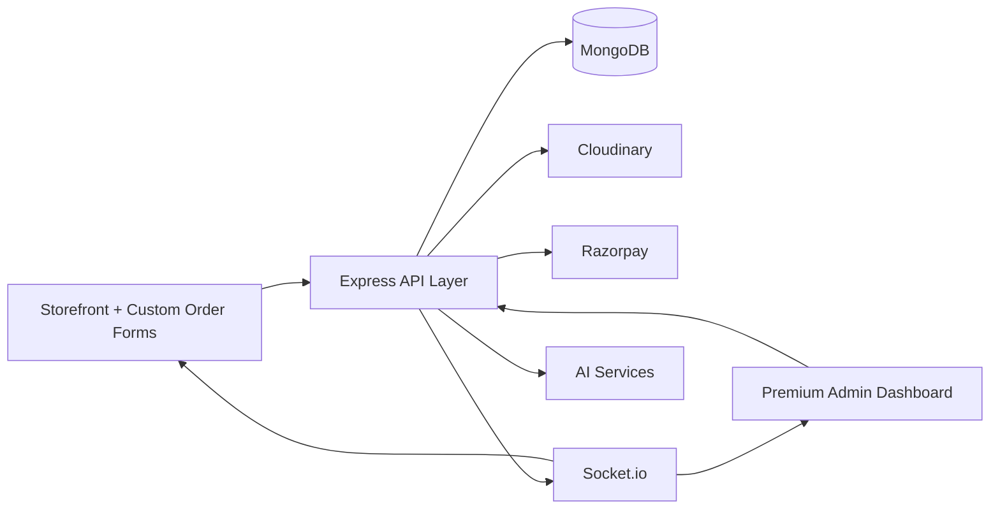
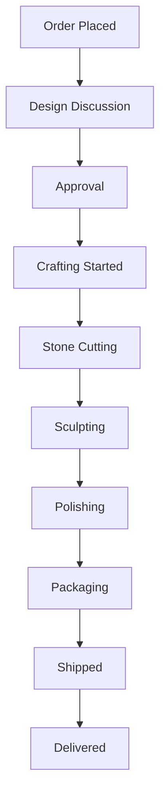
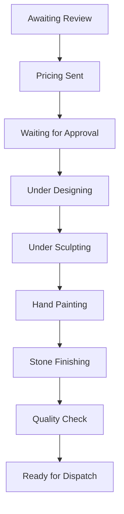
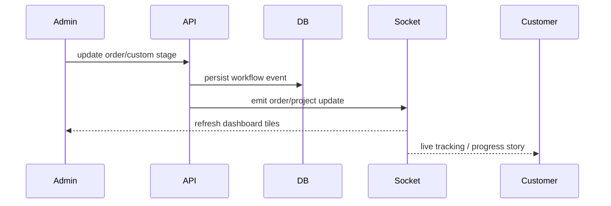

# Premium Admin Dashboard Blueprint

## 1. Product Direction

Build the admin as an artisan-first operating system:

- Shopify-grade commerce controls
- Etsy-grade storytelling and handcrafted presentation
- ERP-grade production, inventory, invoicing, and procurement workflows
- CRM-grade customer memory, segmentation, and outreach

The implementation added in this repo is the premium `/admin` foundation. The rest of this document maps the full expansion path.

## 2. Architecture Overview

### Frontend

- `Next.js App Router`
- `TypeScript`
- `Tailwind CSS`
- `Framer Motion`
- `React Query`
- `Zustand`
- `Recharts`
- `Lucide`
- shadcn-style UI primitives

### Backend

- `Node.js + Express`
- `MongoDB + Mongoose`
- `JWT auth`
- `Socket.io`
- `Razorpay`
- `Cloudinary`

### Operating Model



## 3. Recommended Folder Structure

### Frontend

```txt
frontend/src/
  app/
    admin/
      layout.tsx
      loading.tsx
      page.tsx
      orders/
      custom-studio/
      artisans/
      inventory/
      customers/
      finance/
      analytics/
      media/
      marketing/
      settings/
  components/
    admin/
      AdminWorkspace.tsx
      AdminCommandPalette.tsx
      AdminCharts.tsx
    layout/
      SiteChrome.tsx
    providers/
      AppProviders.tsx
    ui/
      badge.tsx
      button.tsx
      card.tsx
      input.tsx
      skeleton.tsx
  hooks/
    useAdminDashboard.ts
    useAdminOrders.ts
    useAdminCustomProjects.ts
  lib/
    admin/
      dashboard.ts
      types.ts
      orders.ts
      permissions.ts
  stores/
    admin-ui-store.ts
    admin-kanban-store.ts
    admin-filter-store.ts
```

### Backend

```txt
backend/src/
  models/
    Order.ts
    CustomOrder.ts
    User.ts
    Artisan.ts
    InventoryItem.ts
    Supplier.ts
    Invoice.ts
    Shipment.ts
    PaymentLedger.ts
    MediaAsset.ts
    ReviewModeration.ts
    Role.ts
    AuditLog.ts
    WhatsAppTemplate.ts
  routes/
    adminRoutes.ts
    orderRoutes.ts
    customOrderRoutes.ts
    artisanRoutes.ts
    inventoryRoutes.ts
    customerRoutes.ts
    financeRoutes.ts
    mediaRoutes.ts
    marketingRoutes.ts
    roleRoutes.ts
  services/
    realtimeService.ts
    razorpayService.ts
    invoiceService.ts
    cloudinaryService.ts
    whatsappService.ts
    analyticsService.ts
    aiService.ts
  middleware/
    authMiddleware.ts
    permissionMiddleware.ts
    rateLimitMiddleware.ts
    auditMiddleware.ts
```

## 4. Database Schema Plan

### Core Collections

#### `users`

Extend current user model with:

- `role: "super-admin" | "order-manager" | "artisan-manager" | "customer-support" | "marketing-manager"`
- `permissions: string[]`
- `crmTags: string[]`
- `vipTier`
- `lastContactedAt`

#### `roles`

```ts
{
  name: string;
  code: string;
  permissions: string[];
  isSystemRole: boolean;
}
```

#### `orders`

Extend current order model with:

- `priority: "low" | "medium" | "high" | "urgent"`
- `workflowStage`
- `artisanAssignments[]`
- `internalNotes[]`
- `invoiceId`
- `shipmentId`
- `refundStatus`
- `returnStatus`
- `eta`
- `kanbanLane`

#### `customOrders`

Extend current custom order model with:

- `quotation`
- `advancePayment`
- `revisionCount`
- `approvalActions[]`
- `discussionThreads[]`
- `annotations[]`
- `designFiles[]`
- `cadFiles[]`
- `comparisonAssets[]`
- `customerVisibleStory[]`

#### `artisans`

```ts
{
  name: string;
  phone: string;
  specialization: string[];
  skills: string[];
  activeProjects: ObjectId[];
  attendance: AttendanceEntry[];
  payroll: PayrollEntry[];
  performanceScore: number;
  gallery: string[];
}
```

#### `inventoryItems`

```ts
{
  sku: string;
  name: string;
  materialType: "stone" | "wood" | "bronze" | "resin" | "packaging";
  unit: string;
  quantity: number;
  reorderLevel: number;
  supplier: ObjectId;
  barcode: string;
  purchaseHistory: PurchaseEntry[];
  usageHistory: UsageEntry[];
}
```

#### `customers`

Either extend `users` or create a dedicated CRM projection:

- order history
- favorite products
- customization history
- total spending
- RFM score
- WhatsApp number
- segmentation labels

#### `invoices`

```ts
{
  invoiceNumber: string;
  order: ObjectId;
  customerSnapshot: CustomerSnapshot;
  gst: GstBreakdown;
  qrCodeUrl: string;
  pdfUrl: string;
  status: "draft" | "issued" | "paid" | "refunded";
}
```

#### `shipments`

- courier
- trackingId
- shippingLabelUrl
- deliveryEta
- status events

#### `mediaAssets`

- folder
- tags
- sourceType
- relatedEntity
- cloudinary metadata

#### `auditLogs`

- actor
- action
- entityType
- entityId
- before
- after
- ip
- userAgent

## 5. API Route Map

### Overview

```txt
GET    /api/admin/dashboard
GET    /api/admin/analytics
GET    /api/admin/notifications/live
```

### Orders

```txt
GET    /api/admin/orders
GET    /api/admin/orders/:id
PATCH  /api/admin/orders/:id/status
PATCH  /api/admin/orders/:id/priority
PATCH  /api/admin/orders/:id/assign-artisan
POST   /api/admin/orders/bulk-export
POST   /api/admin/orders/:id/invoice
POST   /api/admin/orders/:id/shipping-label
POST   /api/admin/orders/:id/refund
POST   /api/admin/orders/:id/return
```

### Custom Studio

```txt
GET    /api/custom-orders
GET    /api/custom-orders/:id
PATCH  /api/custom-orders/:id/stage
PATCH  /api/custom-orders/:id/approval
POST   /api/custom-orders/:id/quotation
POST   /api/custom-orders/:id/revision
POST   /api/custom-orders/:id/comment
POST   /api/custom-orders/:id/assets
POST   /api/custom-orders/:id/annotations
```

### Artisans

```txt
GET    /api/artisans
POST   /api/artisans
GET    /api/artisans/:id
PATCH  /api/artisans/:id
POST   /api/artisans/:id/attendance
POST   /api/artisans/:id/gallery
```

### Inventory

```txt
GET    /api/inventory
POST   /api/inventory
PATCH  /api/inventory/:id
POST   /api/inventory/:id/restock
POST   /api/inventory/:id/consume
GET    /api/inventory/alerts
```

### CRM

```txt
GET    /api/customers
GET    /api/customers/:id
PATCH  /api/customers/:id/tags
POST   /api/customers/:id/notes
POST   /api/customers/:id/festival-message
```

### Finance

```txt
GET    /api/finance/overview
GET    /api/finance/reports
GET    /api/finance/profit
GET    /api/finance/gst
POST   /api/finance/invoices/:orderId/generate
POST   /api/finance/refunds/:orderId
```

### Media

```txt
GET    /api/media
POST   /api/media/upload
PATCH  /api/media/:id
DELETE /api/media/:id
```

### Marketing

```txt
GET    /api/marketing/campaigns
POST   /api/marketing/campaigns
GET    /api/marketing/coupons
POST   /api/marketing/coupons
PATCH  /api/marketing/banners/:id
```

## 6. UI Layout System

### Shell

- Sticky premium glass sidebar
- Collapsible desktop rail
- Mobile slide-over nav
- Search-everywhere header
- Global command palette
- Theme switch
- Floating quick action buttons

### Page Grid

- `Hero`: executive summary + action buttons
- `Metrics`: 6-card premium KPI deck
- `Analytics`: charts, pie, funnel, heatmap
- `Workflows`: orders + custom studio progress lanes
- `Operations`: inventory, artisans, CRM, campaigns
- `Architecture deck`: module cards for roadmap visibility

## 7. Component Hierarchy

```txt
RootLayout
  AppProviders
    SiteChrome
      /admin
        AdminWorkspace
          DesktopSidebar
          MobileSidebar
          AdminCommandPalette
          MetricCards
          RevenueAreaChart
          StatusPieChart
          FunnelBarChart
          HeatmapGrid
          WorkflowLanes
          LowStockCards
          CustomQueueCards
          ArtisanCards
          ActivityFeed
          CampaignCards
          ModuleDeck
```

## 8. State Management Structure

### React Query

- `admin-dashboard`
- `admin-orders`
- `admin-custom-orders`
- `admin-artisans`
- `admin-inventory`
- `admin-customers`
- `admin-finance`

Use React Query for:

- server data
- caching
- optimistic workflow updates
- refetch on realtime events

### Zustand

Use lightweight client stores for:

- sidebar collapsed state
- mobile nav open state
- command palette open state
- global search
- kanban drag state
- persistent filters

## 9. Workflow Diagrams

### Order Workflow



### Custom Project Workflow



### Realtime Loop



## 10. Dashboard Page Design Map

### `/admin`

- executive overview
- KPI cards
- revenue, funnel, and status charts
- live activity
- low stock alerts

### `/admin/orders`

- table + kanban toggle
- bulk actions
- GST invoice and labels
- refund and return actions

### `/admin/custom-studio`

- project board
- side-by-side comparisons
- image annotations
- approval buttons
- revision history

### `/admin/artisans`

- artisan cards
- attendance
- active workload
- gallery uploads

### `/admin/inventory`

- stock ledger
- low stock alerts
- supplier history
- material consumption

### `/admin/customers`

- customer profiles
- WhatsApp history
- saved requests
- segmentation

### `/admin/finance`

- revenue
- GST
- profit
- invoices
- refunds

### `/admin/analytics`

- region and device sales
- conversion funnels
- seasonal demand
- material profitability

## 11. Mobile Responsive Layout

- sticky top header with search
- bottom quick action dock
- swipe-friendly cards
- collapsible section stacks
- thumb-friendly filters
- WhatsApp quick action
- mobile notification center

## 12. Animation System

Use Framer Motion for:

- section reveal on load
- card hover lift
- sidebar collapse transitions
- command palette entrance
- KPI count transitions
- live status shimmer
- drawer and modal transitions

Recommended motion rules:

- `180ms` for hover
- `280ms` for drawers and dialogs
- `350-450ms` for section reveals
- spring only for tactile UI, not every element

## 13. Premium UI Suggestions

- palette based on granite, bronze, sand, temple gold
- serif display typography for headings
- glass panels with warm edges instead of generic blue blur
- rounded luxury surfaces, not sharp SaaS boxes
- restrained gold accents on action items
- quiet dark mode with warm highlights
- handcrafted copy tone: “atelier”, “crafting”, “concierge”, “studio”

## 14. Security Best Practices

- keep JWT auth, add role + permission middleware
- validate every payload server-side with strict schemas
- sign Cloudinary uploads, do not trust raw asset URLs
- rate-limit auth, upload, finance, and AI routes
- record all admin mutations in `auditLogs`
- protect invoice generation and refunds with scoped permissions
- isolate Socket.io events by room and role
- sanitize file metadata and annotations
- use server-generated invoice numbers and GST totals
- add Mongo indexes on `status`, `stage`, `createdAt`, `user`, `sku`

## 15. Scalable Production Architecture

### Short-Term

- keep monolith
- add module-specific route files and services
- expand current schemas incrementally
- move uploads to Cloudinary

### Mid-Term

- background workers for:
  - PDF invoice generation
  - WhatsApp automation
  - campaign dispatch
  - analytics aggregation
- Redis cache for dashboard aggregates
- queue for heavy media processing

### Long-Term

- split into bounded modules:
  - commerce
  - custom studio
  - CRM
  - finance
  - marketing
- add event-driven workflow logging
- build warehouse-ready inventory and procurement engine

## 16. Current Repo Deliverables

Implemented in this pass:

- premium `/admin` dashboard shell
- glassmorphism luxury admin theme
- dark/light mode
- command palette
- React Query admin data layer
- Zustand UI state
- Recharts analytics widgets
- mobile/desktop admin navigation
- realtime Socket.io refresh hooks
- architecture blueprint document

Next build phase:

1. Break `/admin` into module routes.
2. Add backend models for `Artisan`, `InventoryItem`, `Invoice`, `Role`, `AuditLog`, and `MediaAsset`.
3. Implement true RBAC beyond `isAdmin`.
4. Add Cloudinary, GST PDF, WhatsApp Cloud API, and role-restricted finance flows.
